# Movie-Central

## Description

**Movie-Central** is an advanced web application designed to let users search, explore, and manage movie reviews and showtimes. This platform combines the power of React for a responsive frontend with Node.js and PostgreSQL for backend functionality, offering an intuitive user experience.

## Team

| Name               | GitHub Name      | Role                      |
| ------------------ | ---------------- | ------------------------- |
| Curtis             | Curtis-Thomas    | Project Management/Github |
| Sujeewa            | SampathHM        | Frontend                  |
| Mahesh             | t3idma00         | Frontend                  |
| Eaint Mon (Steffi) | SteffiEaint      | Backend                   |
| Sanjaya            | sanjayabhattarai | Backend                   |
| Riku               | RikuRautio       | CI/CD                     |

## Table of Contents

- [Tech Stack](#tech-stack)
- [Installation and Setup](#Installation-and-Setup)
------------------ 

- [GREEN TABLE](#green-table)
- [BLUE TABLE](#blue-table)
- [PINK TABLE](#pink-table)

## Tech Stack

### Frontend

HTML | CSS | JavaScript | React 

### Backend

Node.js | Express | PostgreSQL

### Deployment

| Technology   | Description                                                          |
| ------------ | -------------------------------------------------------------------- |
| **Frontend** | Hosted on **Netlify** for fast, reliable, and continuous deployment. |
| **Backend**  | Deployed on **Render** for API and database services.                |

**Movie-Central** operates using a client-server architecture:

1. **Frontend**: Built with **React**, it handles all user interactions like browsing movies, viewing reviews, and managing user accounts. It communicates with the backend via API calls.
2. **Backend**: Powered by **Node.js** and **Express**, the backend processes requests from the frontend, handling movie data, user authentication, and more.
3. **Database**: **PostgreSQL** stores all movie data, user profiles, and reviews, ensuring data is stored persistently and can be queried efficiently.
4. **Authentication**: Users sign up and log in to access personalized features such as favorites, reviews, and movie groups. Authentication is managed securely through the auth0 api and @auth0/auth0-react package.

## Installation and Setup

To run the project locally, follow these steps:

1. **Clone the repository**:  
   `git clone https://github.com/group13-Advanced-Web-Project/movie-app.git`

2. **Install dependencies**:  
   Navigate to the frontend and backend directories and install the required packages:

   - Frontend:  
     `cd frontend && npm install`
   - Backend:  
     `cd backend && npm install`

3. **Set up environment variables**  
   Create a `.env` file in both the `frontend` and `backend` directories and add the required environment variables.

   ### FRONTEND .env

   - **Server URL**  
     - `REACT_APP_API_URL=`

   - **TMDB API Key**  
     - `REACT_APP_TMDB_API_KEY=`

   ### BACKEND .env

   - **Database Connection Details**
     - `DB_USER=`
     - `DB_HOST=`
     - `DB_PORT=`
     - `DB_PASSWORD=`
     - `DB_NAME=`

   - **TMDB API Key**  
     - `TMDB_API_KEY=`

4. **Set up PostgreSQL**:

   - Create a local or cloud PostgreSQL database.
   - Refer to \movie-app\backend\index.js for database initialization.

5. Replace auth0 details

- To create your own user list and have control over user login and access.
- Create an account at https://auth0.com/
- Create a single page application on auth0 dashboard
- Under your application settings tab, add to Allowed Callback URLs and Allowed Logout URLs:

http://localhost:3000/

note: Change the port number if required, and add relevant domain URL if you dploy to live site.

- Replace frontend/index.js Auth0Provider domain and clientId details

6. **Start the application**:
   - Run the backend server:  
     `cd backend && npm start`
   - Run the frontend server:  
     `cd frontend && npm start`

The app should now be running locally at [`http://localhost:3000`](http://localhost:3000/).

## Green Table

- [Responsiveness](#responsiveness)
- [Sign up](#sign-up)
- [Sign in](#sign-in)
- [Removing account](#removing-account)
- [Search](#search)
- [Showtimes](#showtimes)
- [Group page](#group-page)
- [Adding a member](#adding-a-member)
- [Removing a member](#removing-a-member)
- [Customizing group page](#customizing-group-page)
- [Review a movie](#review-a-movie)
- [Browsing reviews](#browsing-reviews)
- [Favorites](#favorites)
- [Sharing favorites](#sharing-favorites)
- [Optional feature](#optional-feature)
- [Deployment](#deployment)

## Responsiveness

CSS is used to provide suitable layout views for different screen sizes:

 Desktop view:

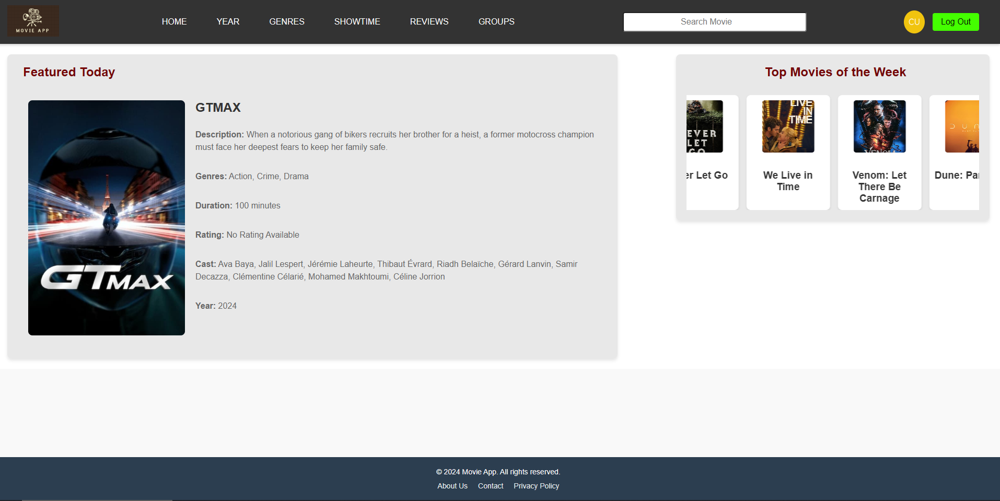

 Tablet view:

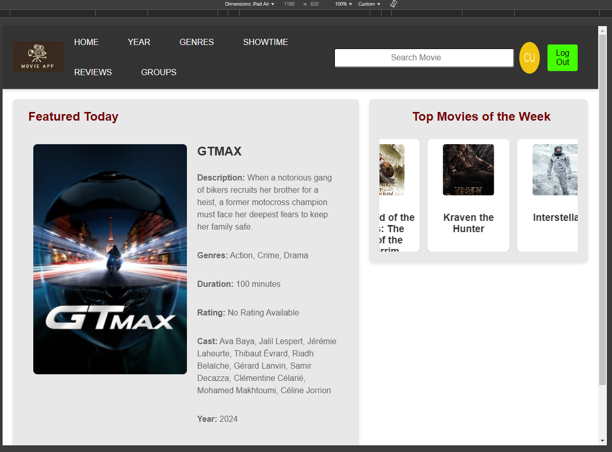
 

 Phone view:

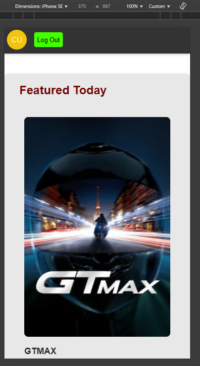

## Sign up

auth0 is used for our user creation and management.

After clicking the login button (top right of screen), the user is shown the sign up screen.

The user has the option to create an account using their google account, or provide a username and password.

If the user provides a username and password, the password must meet the strong requirements.

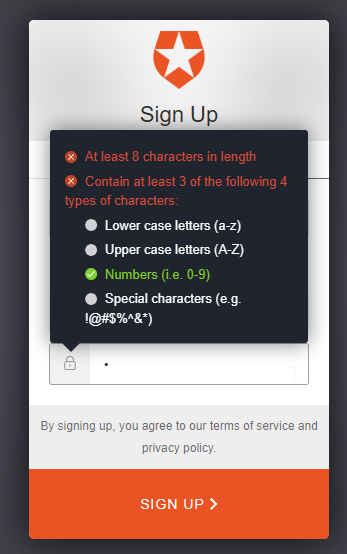

## Sign in

**IMPORTANT** 

If you have not added your own auth0 details 

 Allowed Callback URLs
 - http://localhost:3000/
 - https://movie-app-group13.netlify.app/

 Allowed Logout URLs
  - http://localhost:3000/
  - https://movie-app-group13.netlify.app/

**IMPORTANT** 

After the user has created an account, they can log in using the same screen on the Log in tab.

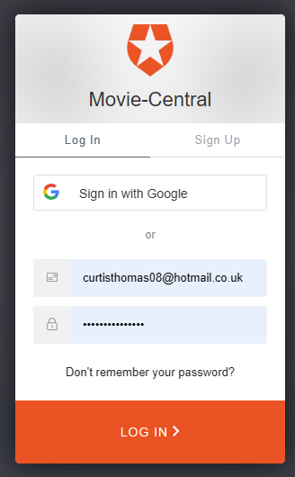

After the user signs in, the users details are checked against our database. 
If they do not have any information in our database, then they are added using their auth0 user.sub (making use of the @auth0/auth0-react package).

## Removing account

To remove account:

1. Navigate to the profile page by clicking the user profile link (top right next to Log Out).

2. On the left of the screen in the profile details section,at the bottom the remove account button can be found.

3. After clicking the remove account button, the profile details will be removed from our database. Any data that used the profile information that has been deleted (such as reviews) will now be replaced with a indicator the account that written the review has been deleted.

4. If the account was part of, or owner of a group. The ownership will automatically be transferred.

## Search

The search results have been limited to **200 results per return**, this is intentional to avoid rate-limiting from the external API.
As a result, some movies may not show in results.

Search features can be found on the header bar and are usable for both logged in and logged out users.

The search is split into 3 filters.

1. Search bar: Filtered by - free input

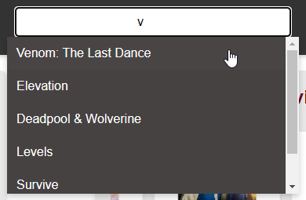

2. Year: Filtered by - Pre-defined year.

3. Genres: Filtered by - Pre-defined genres.

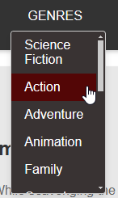

## Showtimes

The showtimes page can be accessed by using the header bar link for both logged in and logged out users.

Filters can be applied for the specific date or theatre, free text search can also be used to find a specific movie.

## Group page

The groups page can be accessed by using the header bar link for both logged in and logged out users, with some functionalities reserved for logged in.

**Groups - Logged out**

When a logged out user visits the groups page, they are able to see all the current groups title and description and search through.
To access the further group features they are prompted to log in.

**Groups - Logged in**

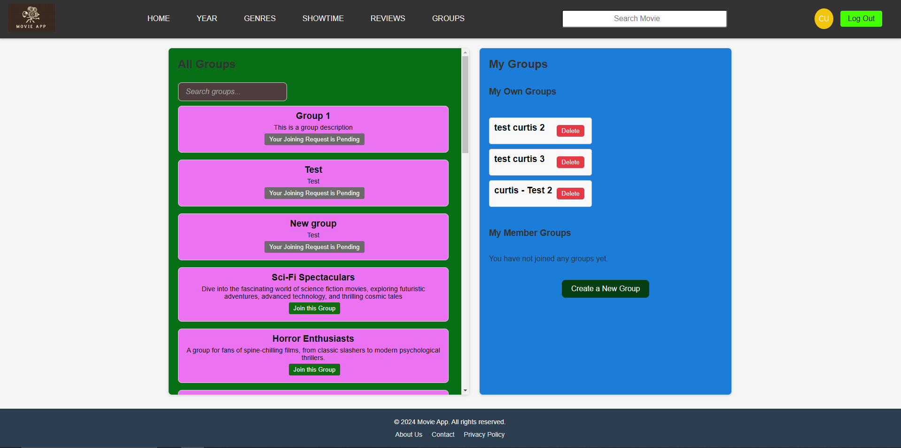

After logging in, the user can make full use of the groups page
- Create a new group
- Manage own groups
- Request to join group
- View join group requests
- View joined group pages

**Groups - Logged in - Group Page**

**Admin View**

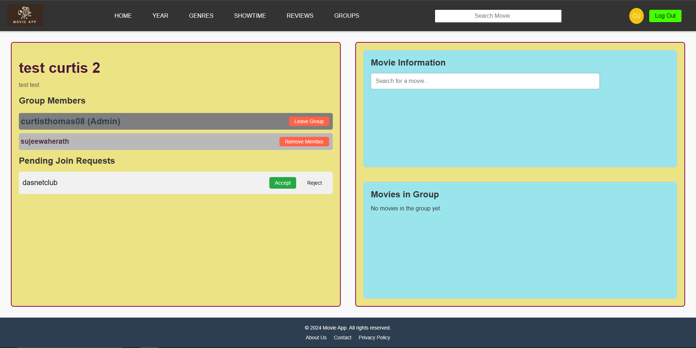

After selecting the group, the user is shown the group page. Admin has the ability to:
- Leave group
## Adding a member
- Accept/Reject join requests

## Removing a member
- Remove member
## Customizing group page
- Add movie to groups page view

After a movie has been added to the page using search box, it can be seen by all group members.

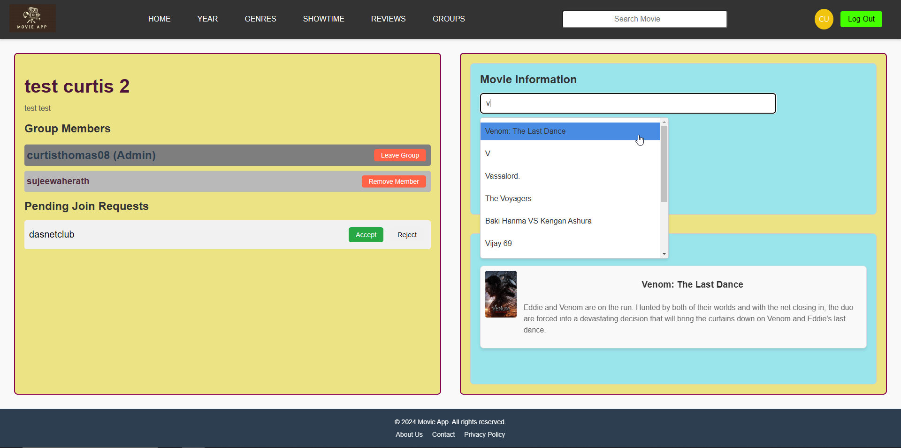

## Review a movie

Only logged in users can review a movie, if a logged out user attempts to Add a review they will be prompted to log in.
Users can only add 1 review per movie.

To review a movie:

1. Navigate to any movie page.
2. Click 'Add Review' Button

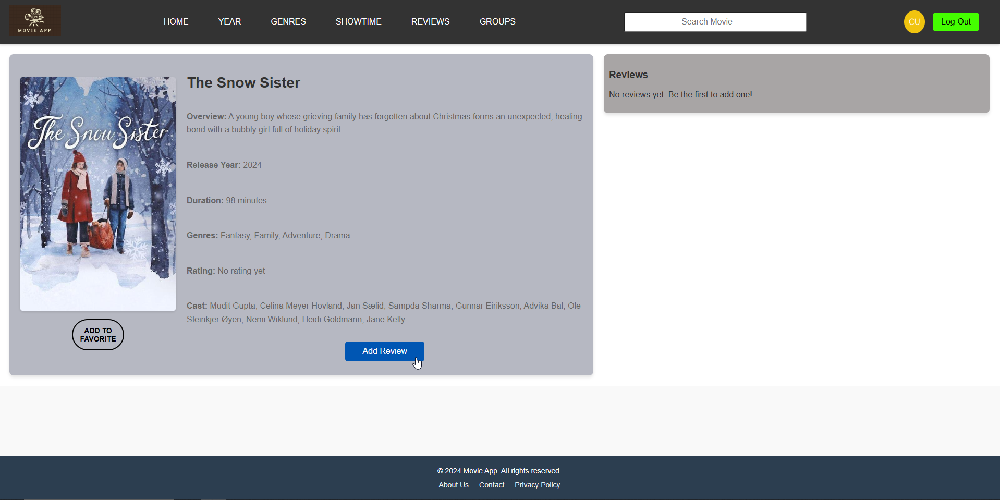

3. Add review text
4. Add review star rating
5. Click submit

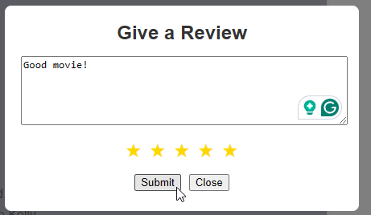

## Browsing reviews

Reviews can be browsed by both logged in and logged out users.
User reviewer emails are censored by default.
There are two ways to brows reviews.

1. Movie Page

If a movie has reviews, they will all be shown on the movie page, if not the placeholder text 'No reviews yet. Be the first to add one!' will be shown. 
The movie rating is populated from their user review rating stored in our database.

2. Reviews page

The reviews page can be accessed by using the header bar link for both logged in and logged out users.

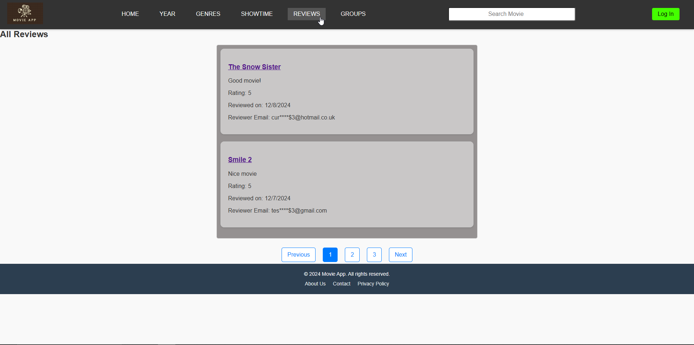

The reviews page shows all submitted reviews in chronological order, newest to oldest.
The movie page can be accessed by clicking the movie title.

## Favorites

Favorites functionality is only usable by logged in users, if a logged out user attempts to Add to Favorite, they will be prompted to log in.

A logged in user can Add a movie to their favorites and then view by:

1. Adding the movie to their favorites list through the movie page 'ADD TO FAVORITE' button (user will be prompted to log in if needed).

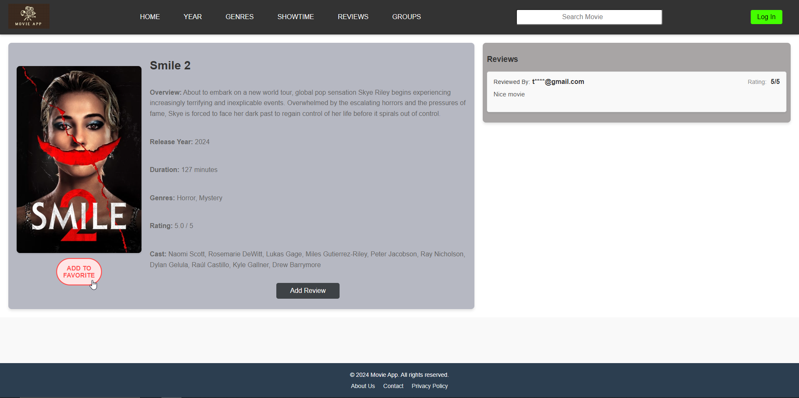

2. After adding, a notification will show to confirm. The Add to Favorite button will now change to remove.

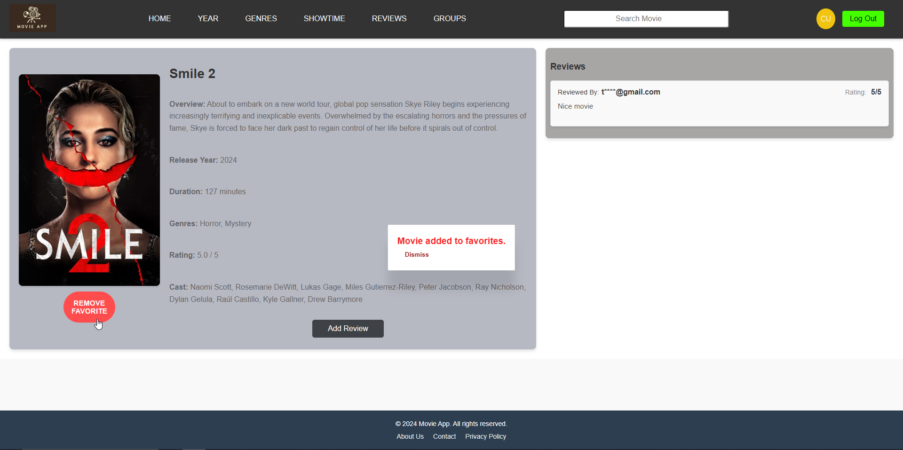

3. View favorites by visiting the profile page which displays all added favorites.

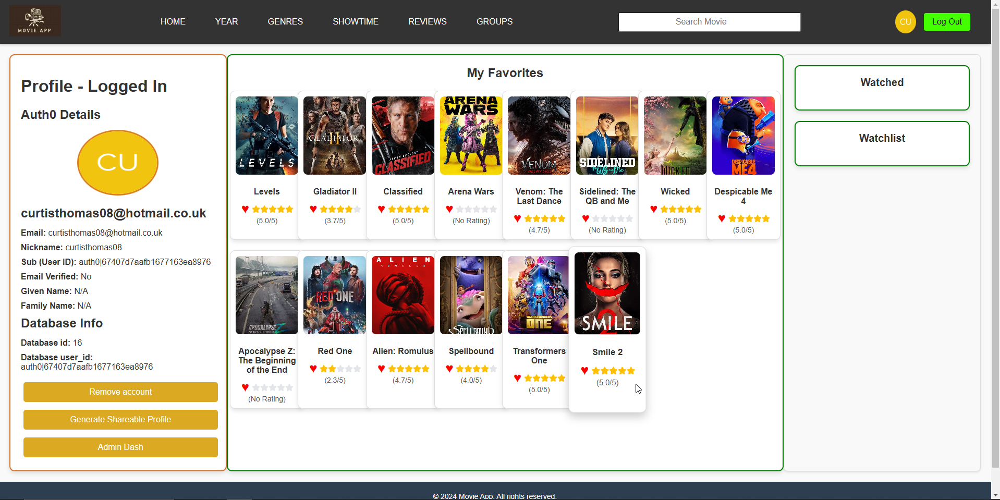

## Sharing favorites

The user must be logged in and visit their profile page to generate a share link by using the 'Generate Sharable Profile' button.

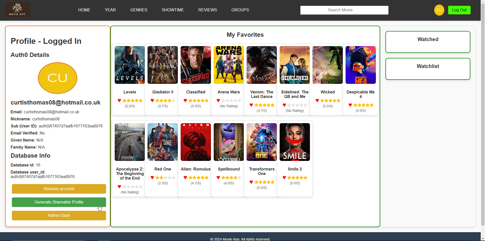

After generating the link, your sharable url will be shown.

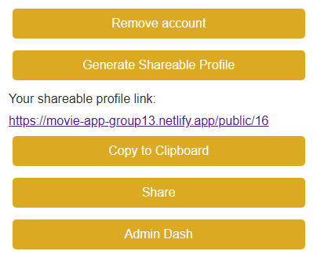

Any person with this link can see your public favorites (logged in or out).

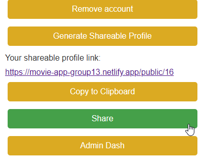

To add the profile to the shared URL's page, the share button must be clicked

Public Profiles page:

To view all public profiles list, visit the Shared URLs page, this can be accessed both logged in and out.

## Optional feature - Admin page

The admin page allows authenticated admin role accounts to view all database tables and make directly queries.

To access the admin page:
1. Create a user role account by logging in through auth0.
2. Connect to the database (suggest through pgAdmin 4)
3. Through the users table identify your account using email, then update the role to admin.
4. Access the admin page through the profile page 'Admin Dash' button.

5. After your account passes the authentication check, the database tables will be viewable.

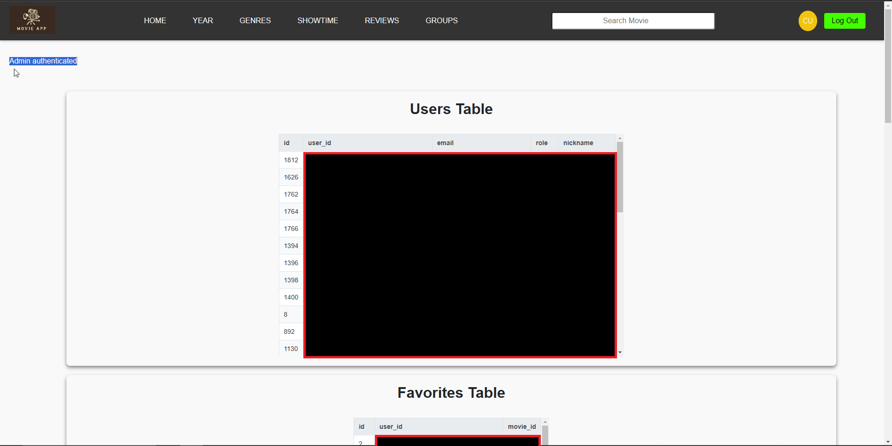

6. Database querying can be achieved from the query box towards the bottom of the page.

## Deployment

For deployment we used free tiers from Netlify (frontend) and render (server and database).

- Frontend deployed using Netlify:

**Netlify Build Settings**

- Server uses render:

**Server Build settings**
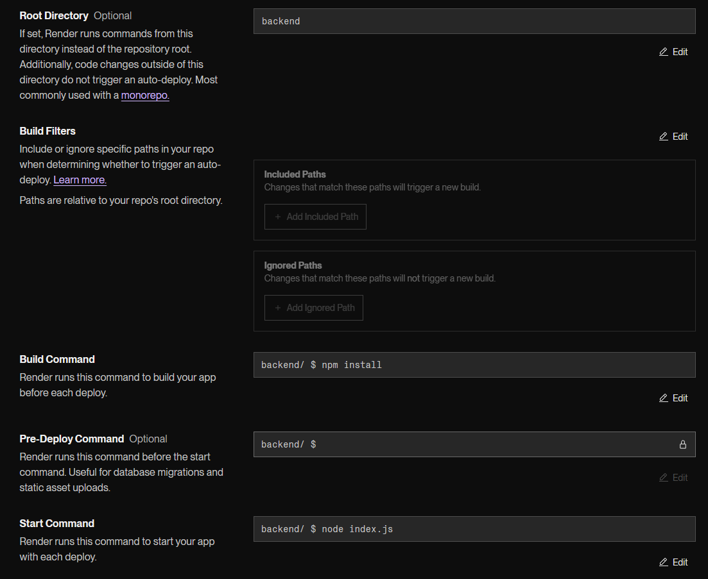

- Database uses render

**Database connection**

## Blue Table

[!! FIGMA FLOWCHART DIAGRAM - LINK !!](https://www.figma.com/board/GEDwmSbW4mDdORlsn0Op3P/Untitled?node-id=25-457&t=9W4VubSLSSegfJfW-1)

- [Class diagram describing database structure](#class-diagram-describing-database-structure)
- [UI design (wireframe)](#ui-design-wireframe)
- [Documenting REST API](#documenting-rest-api)
- [Managing product backlog](#managing-product-backlog)
- [Version control](#version-control)
- [Overall project management and progress](#overall-project-management-and-progress)

## Class diagram describing database structure

## UI design (wireframe)

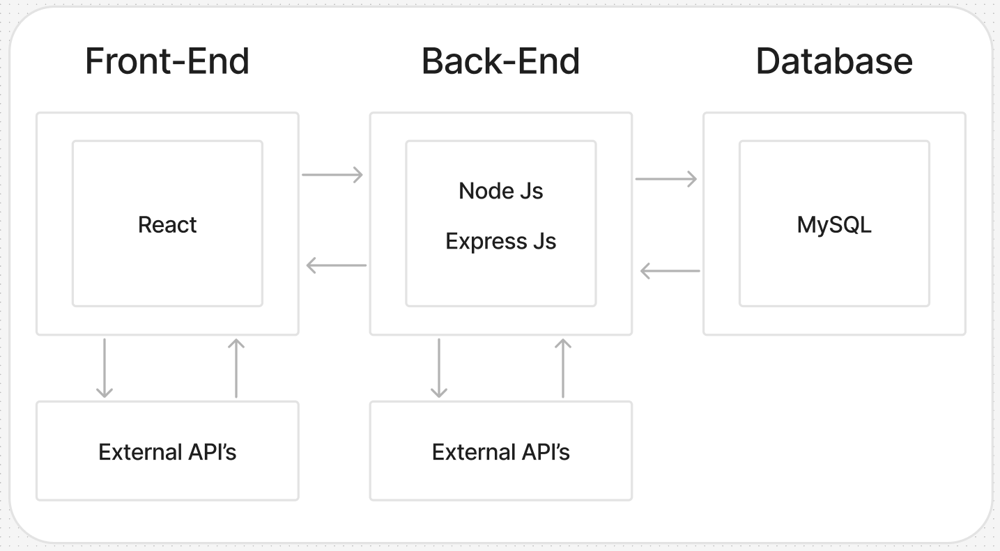
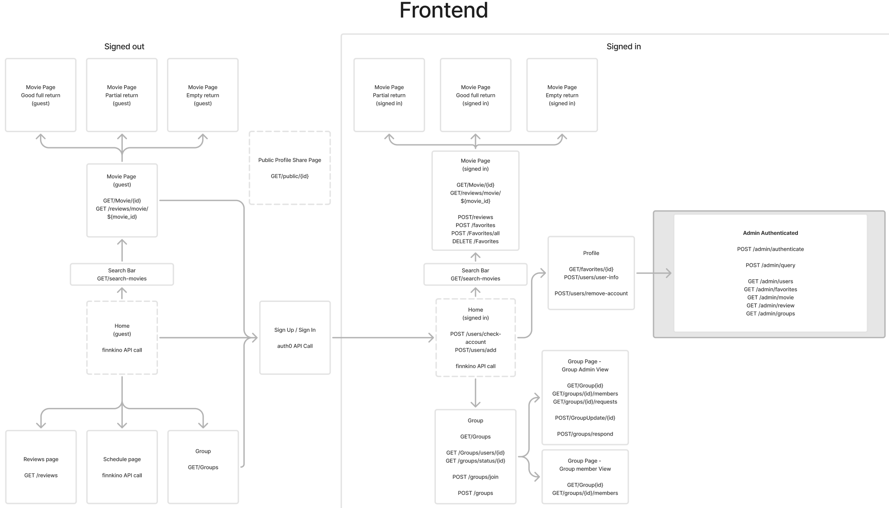

## Documenting REST API

## Managing product backlog

The product was tracked using a Github project board:

https://github.com/orgs/group13-Advanced-Web-Project/projects/2

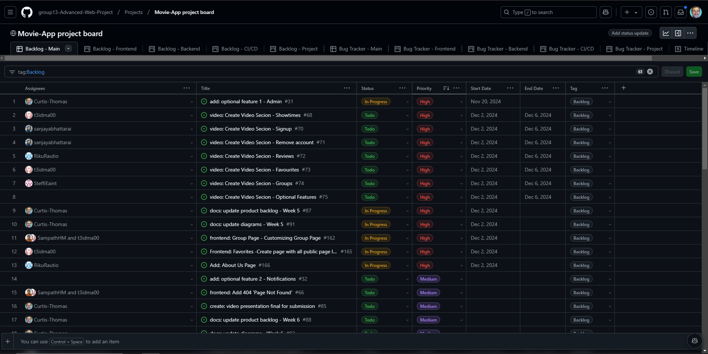

The board is separated into two main tags, Backlog and Bug tracker.

Backlog was populated with all the required tasks to be completed over the whole project, and then additional filtered kanban board were created for team members to easily find their assigned tasks. Teh priority system was used to identify which tasks were to be worked on next.

Bug tracker was used to keep track of any bugs and assigned to the relevant team member, the priority system was also used in the same way.

The timeline tab is used to see a  all of the issues that have been worked on and completed throughout the project, this is filtered by start date to end date.
## Version control

For version control, we decided to use a open source methodology of forking and having 1 person manage all of the pull requests to minimize merge conflicts.
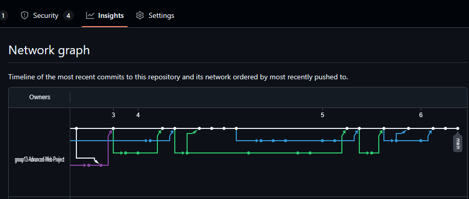

This allowed us to deploy from one branch, and use team members forks and pull request branches for feature development and bug fixes.

## Overall project management and progress

The team stayed on progress by first having a kick off meeting where the following was decided (notes from meetings can be found in docs/note):

1. Target grade
2. Previous project experience and lessons learned
3. Tech stack we will use
4. Role assignments
5. Project management risks and mitigations
6. Weekly meeting schedule

We decided a minimum of 3 weekly meetings were required along with a good use of web messaging and github communication.

- Monday meeting: Talk through the weeks tasks and priorities and prepare for mentor meeting
- Mentor meeting: Talk through progress, blockers and ensure all requirements are understood and worked towards effectively
- Check up meeting: Progress report on the Monday meeting, and any additional resources are need

This format worked well and kept our team moving forwards at a good pace with sufficient communication.

## Pink Table

- [Sign in](#sign-in)
- [Sign out](#sign-out)
- [Sign up](#sign-up)
- [Deleting account](#deleting-account)
- [Browsing reviews](#browsing-reviews)

Throughout the project we have implimented:
- Manual testing
- Jest js unit tests
- Github actions workflow tests

To run the Jest unit tests on local:

1. `cd backend`
2. `npm run test`
## Sign in

## Sign out

## Sign up

## Deleting account

## Browsing reviews

