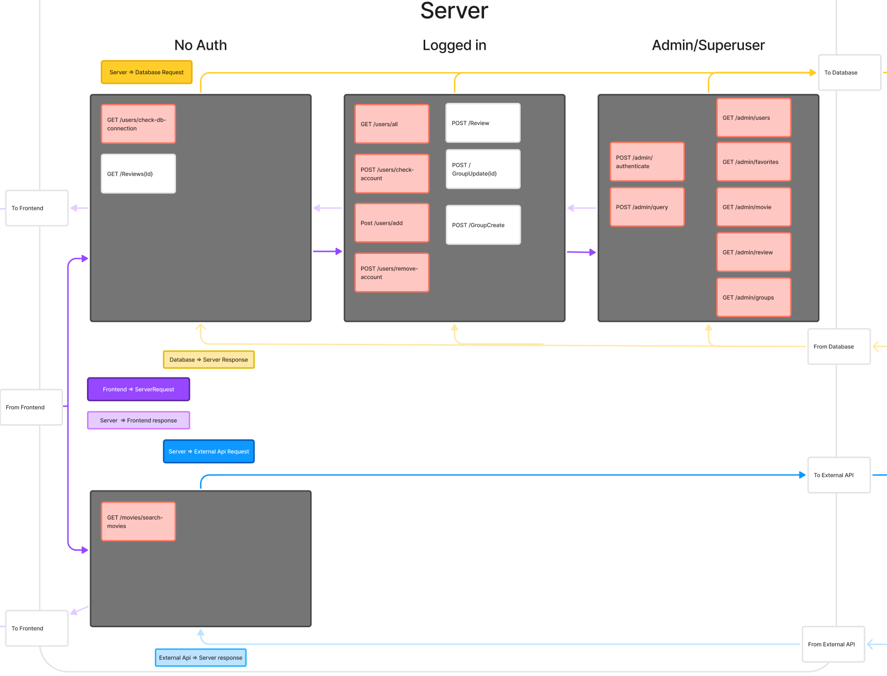
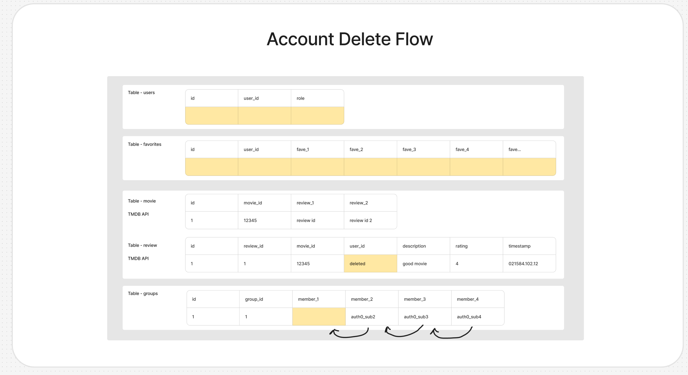

## [!!  Figma Flowchart diagram - Link !!](https://www.figma.com/board/GEDwmSbW4mDdORlsn0Op3P/Untitled?node-id=25-457&t=9W4VubSLSSegfJfW-1)

## Table of Contents

- [Architecture Diagram](#architecture-diagram)
- [Frontend Diagram](#frontend-diagram)
- [Server Diagram](#server-diagram)
- [Database Diagram](#database-diagram)
- [Account Delete Diagram](#account-delete)

## Architecture Diagram

## Frontend Diagram

## Server Diagram

## Database Diagram

## Account Delete Diagram

# Full-Stack Movie Database

## Description
The **Full-Stack Movie Database** is a modern web application designed to allow users to search, explore, and manage movie reviews and showtimes. This platform combines the power of React for a responsive frontend with Node.js and PostgreSQL for backend functionality, offering an intuitive user experience.

## Team

| Name      | Role        |
|-----------|-------------|
| Curtis    | Git         |
| Sujeewa   | Frontend    |
| Mahesh    | Frontend    |
| Steffi    | Backend     |
| Sanjaya   | Backend     |
| Riku      | CI/CD       |

- [About](#about)
- [Features](#features)
- [Tech Stack](#tech-stack)
- [Architecture](#architecture)
- [How It Works](#how-it-works)
- [Installation and Setup](#installation-and-setup)
- [API Endpoints](#api-endpoints)
- [Screenshots](#screenshots)
- [Links](#links)
- [Deployment](#deployment)

## About

The **Full-Stack Movie Database** allows users to explore movies, view their showtimes, and leave reviews. Users can browse movies without creating an account, or register to gain full access to personalized features. Registered users can:

- **Browse Movies**: Access detailed movie information, ratings, and showtimes.
- **Create and Share Favorite Lists**: Users can curate and share their favorite movies with a unique link.
- **Join or Create Movie Groups**: Connect with friends by forming or joining customizable movie groups.
- **Review Movies**: Share thoughts on movies they've watched with ratings and reviews.

This project integrates **React**, **Node.js**, **Express**, and **MySQL**, creating an interactive and scalable movie browsing experience.

## Features

- **Movie Browsing**: Discover a wide selection of movies, complete with essential details such as ratings, reviews, and showtimes.
- **Favorite Movie List**: Build a personal collection of favorite movies for easy access and sharing.
- **Movie Reviews and Ratings**: Add reviews and ratings to help others in their movie selection process.
- **User Authentication**: Secure sign-up and login system for accessing personalized features.
- **Create and Join Movie Groups**: Engage with friends by forming or joining movie groups to discuss and share recommendations.
- **Responsive Design**: Optimized for a smooth experience on desktops, tablets, and smartphones.

## Tech Stack

### Frontend

| Technology | Description |
|------------|-------------|
| **HTML**   | Provides the basic structure for the website. |
| **CSS**    | Ensures responsive design for all devices. |
| **JavaScript** | Powers dynamic interactions on the frontend. |
| **React**  | JavaScript library for building the user interface. |

### Backend

| Technology | Description |
|------------|-------------|
| **Node.js** | A JavaScript runtime for backend logic. |
| **Express** | A lightweight framework for building web applications in Node.js. |
| **PostgreSQL** | A relational database for managing movie data, reviews, and user information. |

### Deployment

| Technology | Description |
|------------|-------------|
| **Frontend** | Hosted on **Netlify** for fast, reliable, and continuous deployment. |
| **Backend**  | Deployed on **Heroku** (or your preferred hosting platform) for API and database services. |

## How It Works

The **Full-Stack Movie Database** operates using a client-server architecture:

1. **Frontend**: Built with **React**, it handles all user interactions like browsing movies, viewing reviews, and managing user accounts. It communicates with the backend via API calls.
2. **Backend**: Powered by **Node.js** and **Express**, the backend processes requests from the frontend, handling movie data, user authentication, and more.
3. **Database**: **PostgreSQL** stores all movie data, user profiles, and reviews, ensuring data is stored persistently and can be queried efficiently.
4. **Authentication**: Users sign up and log in to access personalized features such as favorites, reviews, and movie groups. Authentication is managed securely through **JWT (JSON Web Tokens)**.

This architecture ensures a seamless and interactive experience for users, from discovering movies to interacting with friends and sharing opinions.

## Installation and Setup

To run the project locally, follow these steps:

1. **Clone the repository**:  
   `git clone https://github.com/group13-Advanced-Web-Project/movie-app.git`

2. **Install dependencies**:  
   Navigate to the frontend and backend directories and install the required packages:
   - Frontend:  
     `cd frontend && npm install`
   - Backend:  
     `cd backend && npm install`

3. **Set up environment variables**:  
   Create a `.env` file in both the frontend and backend folders and add the required environment variables.

4. **Set up PostgreSQL**:  
   - Create a local or cloud PostgreSQL database.
   - Run the database schema script to set up tables and relationships.
     > **Add schema script here**.

5. **Start the application**:
   - Run the backend server:  
     `cd backend && npm start`
   - Run the frontend server:  
     `cd frontend && npm start`

The app should now be running locally at `http://localhost:3000`.

## API Endpoints

> Add details and explanation for each API endpoint.

## Screenshots

> Add screenshots of pages.

## Links

- **Live Project**: [URL to live site]
- **Documentation**: [URL to full documentation]
- **Demo**: [URL to demo or video walkthrough]

## Deployment
- Frontend deployed using Netlify to insure fast, reliable, and continuous deployment: https://awamovieapp.netlify.app/
-

