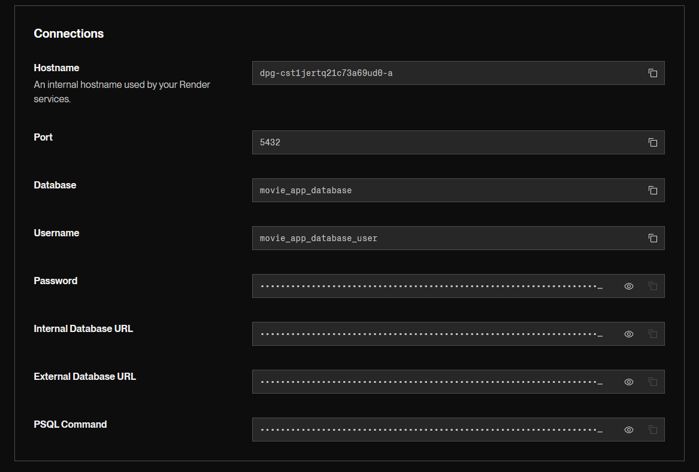

# Movie-Central

## Description

**Movie-Central** is an advanced web application designed to let users search, explore, and manage movie reviews and showtimes. This platform combines the power of React for a responsive frontend with Node.js and PostgreSQL for backend functionality, offering an intuitive user experience.

## Team

| Name               | GitHub Name      | Role                      |
| ------------------ | ---------------- | ------------------------- |
| Curtis             | Curtis-Thomas    | Project Management/Github |
| Sujeewa            | SampathHM        | Frontend                  |
| Mahesh             | t3idma00         | Frontend                  |
| Eaint Mon (Steffi) | SteffiEaint      | Backend                   |
| Sanjaya            | sanjayabhattarai | Backend                   |
| Riku               | RikuRautio       | CI/CD                     |

## Table of Contents

- [Tech Stack](#tech-stack)
- [Installation and Setup](#Installation-and-Setup)
------------------ 

- [GREEN TABLE](#green-table)
- [BLUE TABLE](#blue-table)
- [PINK TABLE](#pink-table)

## Tech Stack

### Frontend

| **HTML** | **CSS** | **JavaScript** | **React** |

### Backend

| **Node.js** |
| **Express** | A lightweight framework for building web applications in Node.js. |
| **PostgreSQL** | A relational database for managing movie data, reviews, and user information. |

### Deployment

| Technology   | Description                                                          |
| ------------ | -------------------------------------------------------------------- |
| **Frontend** | Hosted on **Netlify** for fast, reliable, and continuous deployment. |
| **Backend**  | Deployed on **Render** for API and database services.                |

The **Movie-Central** operates using a client-server architecture:

1. **Frontend**: Built with **React**, it handles all user interactions like browsing movies, viewing reviews, and managing user accounts. It communicates with the backend via API calls.
2. **Backend**: Powered by **Node.js** and **Express**, the backend processes requests from the frontend, handling movie data, user authentication, and more.
3. **Database**: **PostgreSQL** stores all movie data, user profiles, and reviews, ensuring data is stored persistently and can be queried efficiently.
4. **Authentication**: Users sign up and log in to access personalized features such as favorites, reviews, and movie groups. Authentication is managed securely through **JWT (JSON Web Tokens)**.

This architecture ensures a seamless and interactive experience for users, from discovering movies to interacting with friends and sharing opinions.

## Installation and Setup

To run the project locally, follow these steps:

1. **Clone the repository**:  
   `git clone https://github.com/group13-Advanced-Web-Project/movie-app.git`

2. **Install dependencies**:  
   Navigate to the frontend and backend directories and install the required packages:

   - Frontend:  
     `cd frontend && npm install`
   - Backend:  
     `cd backend && npm install`

3. **Set up environment variables**:  
   Create a `.env` file in both the frontend and backend folders and add the required environment variables (hardcoded for now with the local and remote details included).

4. **Set up PostgreSQL**:

   - Create a local or cloud PostgreSQL database.
   - Refer to \movie-app\backend\index.js for database initialization.

5. **Start the application**:
   - Run the backend server:  
     `cd backend && npm start`
   - Run the frontend server:  
     `cd frontend && npm start`

The app should now be running locally at `http://localhost:3000`.

## Green Table

- [Responsiveness](#responsiveness)
- [Sign up](#sign-up)
- [Sign in](#sign-in)
- [Removing account](#removing-account)
- [Search](#search)
- [Showtimes](#showtimes)
- [Group page](#group-page)
- [Adding a member](#adding-a-member)
- [Removing a member](#removing-a-member)
- [Customizing group page](#customizing-group-page)
- [Review a movie](#review-a-movie)
- [Browsing reviews](#browsing-reviews)
- [Favorites](#favorites)
- [Sharing favorites](#sharing-favorites)
- [Optional feature](#optional-feature)
- [Deployment](#deployment)

## Responsiveness
## Sign up
## Sign in
## Removing account
## Search
## Showtimes
## Group page
## Adding a member
## Removing a member
## Customizing group page
## Review a movie
## Browsing reviews
## Favorites
## Sharing favorites
## Optional feature
## Deployment

For deployment we used free tiers from Netlify (frontend) and render (server and database).

- Frontend deployed using Netlify:

**Netlify Build Settings**

- Server uses render:

**Server Build settings**

- Database uses render

**Database connection**

## Blue Table

[!! FIGMA FLOWCHART DIAGRAM - LINK !!](https://www.figma.com/board/GEDwmSbW4mDdORlsn0Op3P/Untitled?node-id=25-457&t=9W4VubSLSSegfJfW-1)

- [Class diagram describing database structure](#class-diagram-describing-database-structure)
- [UI design (wireframe)](#ui-design-wireframe)
- [Documenting REST API](#documenting-rest-api)
- [Managing product backlog](#managing-product-backlog)
- [Version control](#version-control)
- [Overall project management and progress](#overall-project-management-and-progress)

## Class diagram describing database structure

## UI design (wireframe)

## Documenting REST API

## Managing product backlog

The product was tracked using a Github project board:

https://github.com/orgs/group13-Advanced-Web-Project/projects/2

The board is separated into two main tags, Backlog and Bug tracker.

Backlog was populated with all the required tasks to be completed over the whole project, and then additional filtered kanban board were created for team members to easily find their assigned tasks. Teh priority system was used to identify which tasks were to be worked on next.

Bug tracker was used to keep track of any bugs and assigned to the relevant team member, the priority system was also used in the same way.

The timeline tab is used to see a  all of the issues that have been worked on and completed throughout the project, this is filtered by start date to end date.
## Version control

For version control, we decided to use a open source methodology of forking and having 1 person manage all of the pull requests to minimize merge conflicts.

This allowed us to deploy from one branch, and use team members forks and pull request branches for feature development and bug fixes.

## Overall project management and progress

## Pink Table

- [Sign in](#sign-in)
- [Sign out](#sign-out)
- [Sign up](#sign-up)
- [Deleting account](#deleting-account)
- [Browsing reviews](#browsing-reviews)

## Sign in
## Sign out
## Sign up
## Deleting account
## Browsing reviews

